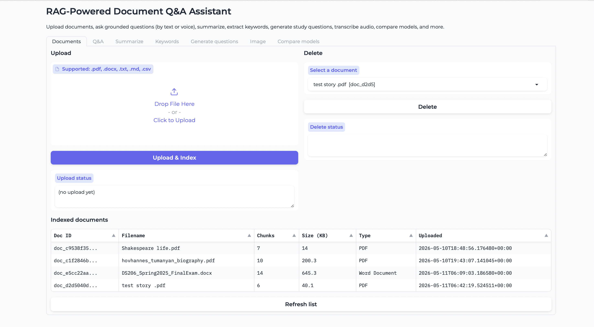
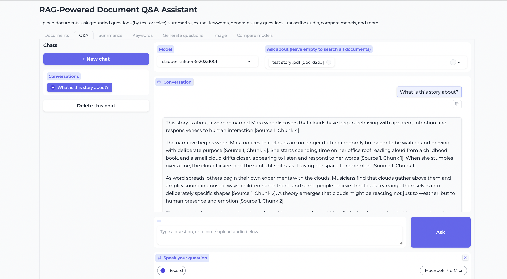
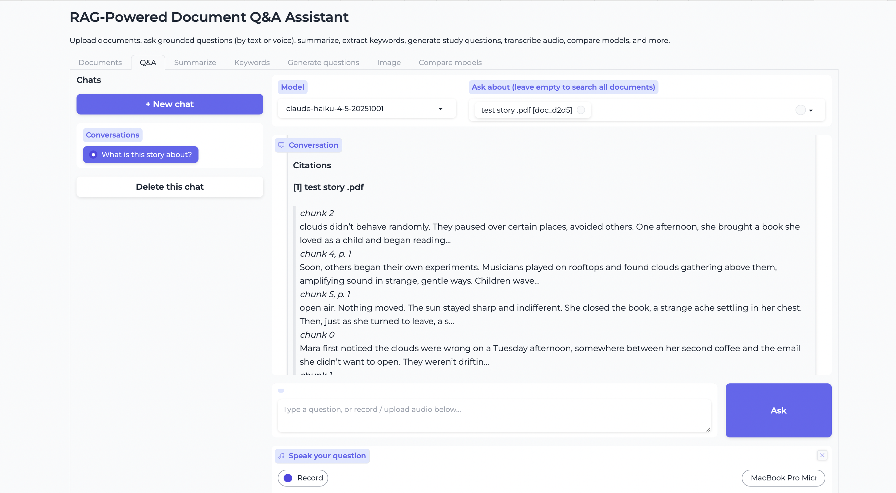
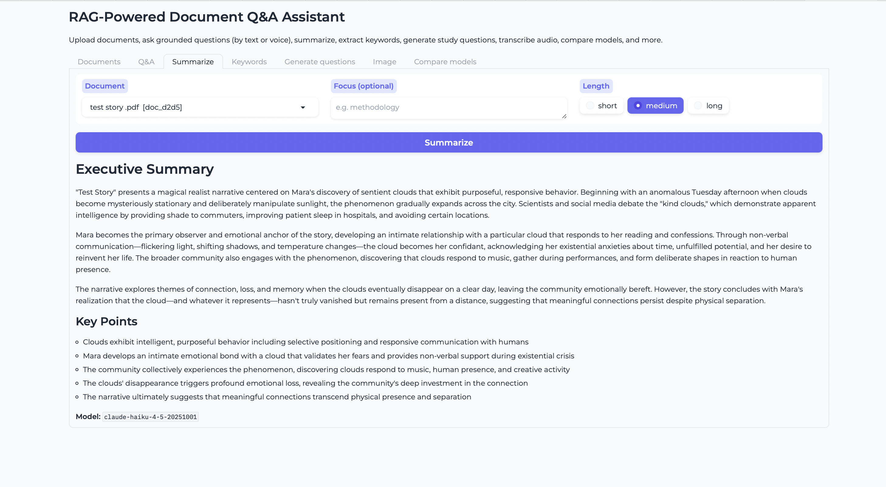
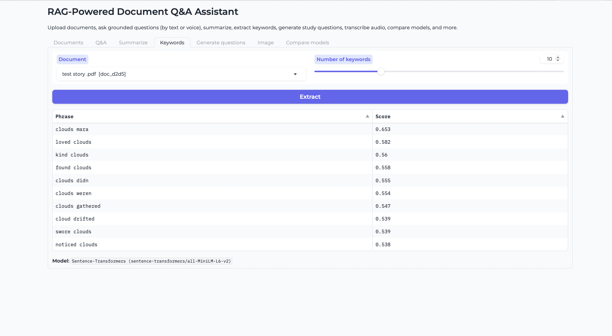
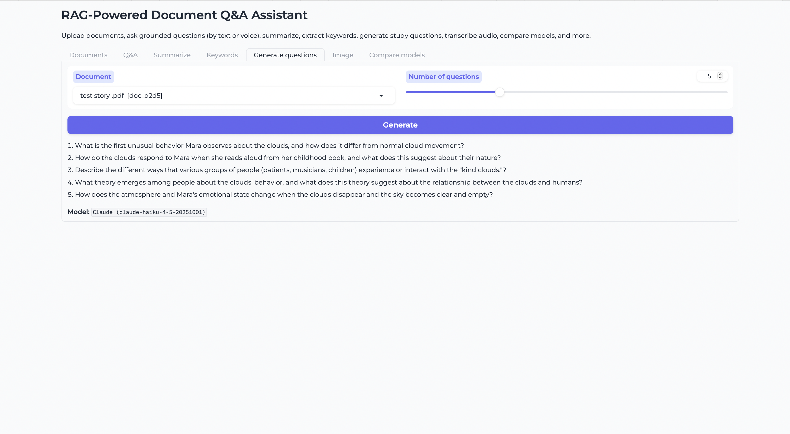
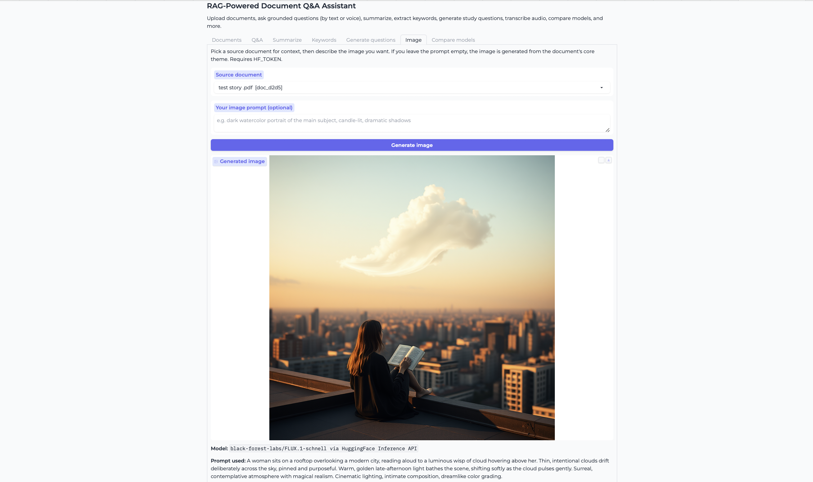
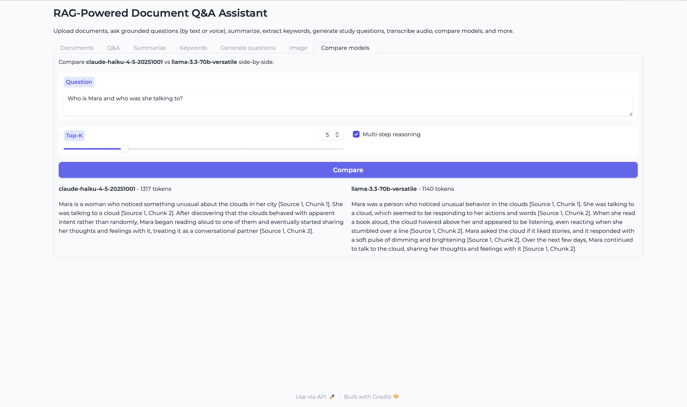

# RAG-Powered Document Q&A Assistant

A full-stack local AI web application that lets you upload your own documents and interact with them through a rich set of AI-powered features - Q&A with citations, summarisation, keyword extraction, question generation, speech-to-text allowing the user to communicate through voice messages, image generation, and model comparison.

---

## Features

| Feature | Description |
|---|---|
| **Document Q&A** | Ask questions in natural language and get answers with inline source citations |
| **Multi-step reasoning** | Complex questions are automatically decomposed into sub-questions |
| **Summarisation** | Map-reduce executive summaries with adjustable length and focus |
| **Keyword extraction** | Semantic keyphrase ranking, fully local, no API key needed |
| **Question generation** | Claude generates study questions from your documents |
| **Image generation** | Provide an optional prompt or let Claude generate one from the document, FLUX.1 renders the result |
| **Speech-to-text** | Voice questions transcribed locally with Whisper, audio never leaves your machine |
| **Model comparison** | Claude Opus vs LLaMA 3.3 70B side-by-side on your own documents |
| **Multi-chat history** | Multiple named conversation threads per session |

---

## Models Used

| Model | Role | Type |
|---|---|---|
| `claude-opus-4-6` | Q&A, summarisation, image prompting, question generation | Anthropic API |
| `llama-3.3-70b-versatile` | Alternative LLM for comparison | Groq API (free tier) |
| `all-MiniLM-L6-v2` | Document embeddings + keyword extraction | Local (Sentence-Transformers) |
| `openai/whisper-base` | Speech-to-text transcription | Local (Transformers) |
| `FLUX.1-schnell` | Text-to-image generation | HuggingFace Inference API |

---

## Project Structure

```
├── backend/
│   ├── agents/
│   │   ├── __init__.py
│   │   ├── rag_agent.py          # RAG pipeline + keyword extraction
│   │   ├── summarize_agent.py    # Map-reduce summarisation
│   │   ├── stt_agent.py          # Whisper speech-to-text
│   │   ├── image_agent.py        # Claude + FLUX.1 image generation
│   │   └── qg_agent.py           # Study question generation
│   ├── ingestion/
│   │   ├── __init__.py
│   │   ├── loader.py             # Document loaders (PDF, DOCX, TXT, CSV, MD)
│   │   └── chunker.py            # Recursive text chunking
│   ├── vectorstore/
│   │   ├── __init__.py
│   │   └── store.py              # ChromaDB wrapper + document registry
│   ├── __init__.py
│   ├── config.py                 # All settings via environment variables
│   ├── models.py                 # Pydantic request/response schemas
│   ├── main.py                   # FastAPI app + all REST endpoints
│   └── chat_history.py           # In-memory multi-chat session store
├── frontend/
│   └── gradio_app.py             # Gradio UI: all tabs and event handlers
├── assets/
│   ├── documents_tab.png
│   ├── qa_tab_answer.png
│   ├── qa_tab_sources.png
│   ├── summary_tab.png
│   ├── keywords_tab.png
│   ├── question_generation_tab.png
│   ├── image_generation_tab.png
│   └── comparison_tab.png
├── requirements.txt
├── start.sh                      # Mac/Linux startup script
├── start.ps1                     # Windows startup script
└── .env                          # API keys (not committed)
```

---

## Prerequisites

- Python 3.10 or higher
- An [Anthropic API key](https://console.anthropic.com/)
- *(Optional)* A [Groq API key](https://console.groq.com/)  - for LLaMA model comparison
- *(Optional)* A [HuggingFace token](https://huggingface.co/settings/tokens)  - for image generation

---

## Setup & Running

### Mac / Linux  - use `start.sh`

```bash
# 1. Clone the repository
git clone https://github.com/arpine2004/GenAI-Project.git
cd <repo-folder>

# 2. Create and activate a virtual environment
python3 -m venv .venv
source .venv/bin/activate

# 3. Install dependencies
pip install -r requirements.txt

# 4. Fill in your API keys in the .env file (see Configuration below)

# 5. Start the server
bash start.sh
```

> **Mac users:** always use `start.sh`. Do not use `start.ps1` as it is a PowerShell script and will not work on macOS.

### Windows  - use `start.ps1`

```powershell
.\start.ps1
```

> **Windows users:** always use `start.ps1`. If you get a permissions error, run this first:
> ```powershell
> Set-ExecutionPolicy -ExecutionPolicy RemoteSigned -Scope CurrentUser
> ```


Once running, open your browser at:

| URL | Description |
|---|---|
| `http://localhost:8000/app` | Main UI |
| `http://localhost:8000/docs` | Interactive API docs |
| `http://localhost:8000/health` | Health check |

---

## Configuration

The `.env` file is intentionally not committed to git, it lives only on your local machine. Each person must create their own. A template is provided:

```bash
cp .env.example .env
# then open .env and fill in your keys
```

Only `ANTHROPIC_API_KEY` is required to run the core Q&A features.

```env
# Required
ANTHROPIC_API_KEY=your_anthropic_key_here

# Optional  - enables LLaMA model comparison tab
GROQ_API_KEY=your_groq_key_here

# Optional  - enables image generation tab
HF_TOKEN=your_huggingface_token_here

# Optional  - override defaults
CLAUDE_MODEL=claude-opus-4-6
RETRIEVAL_TOP_K=5
CHUNK_SIZE=1000
CHUNK_OVERLAP=200
```

Full list of supported variables and their defaults can be found in `backend/config.py`.

---

## Supported File Formats

`.pdf` · `.docx` · `.txt` · `.md` · `.csv`

> **Note:** Scanned PDFs (image-only) are not supported, the document must contain extractable text.

---

## How It Works

1. **Upload** - Documents are loaded, split into ~1000-character overlapping chunks, embedded with `all-MiniLM-L6-v2`, and stored in a local ChromaDB vector database.
2. **Retrieve** - On each question, the query is embedded and the top-K most semantically similar chunks are retrieved using cosine similarity.
3. **Generate** - Retrieved chunks are passed to Claude as grounded context. Claude answers using only the provided sources and cites them inline.
4. **Cite**  - Every answer includes citations showing the source document, chunk, page number, and a text excerpt.

---

## API Endpoints

| Method | Endpoint | Description |
|---|---|---|
| `GET` | `/health` | System status and model info |
| `GET` | `/documents` | List all indexed documents |
| `POST` | `/documents/upload` | Upload and index a document |
| `DELETE` | `/documents/{doc_id}` | Remove a document |
| `POST` | `/query` | Ask a question (RAG) |
| `POST` | `/summarize` | Summarise a document |
| `POST` | `/keywords` | Extract keywords |
| `POST` | `/transcribe` | Transcribe a WAV audio file |
| `POST` | `/generate-questions` | Generate study questions |
| `POST` | `/generate-image` | Generate an image from a document |
| `POST` | `/compare` | Compare two models side-by-side |

Full request/response schemas are available at `/docs` when the server is running.

---

## App Interface

### Documents
Upload and manage your documents, supports PDF, DOCX, TXT, CSV, and Markdown.



### Q&A  - Answer
Ask questions in natural language and get grounded answers with inline source citations.



### Q&A  - Sources
Expandable citation panel showing the source document, chunk, page, and text excerpt for every claim.



### Summarise
Map-reduce executive summary with adjustable length and focus keywords.



### Keyword Extraction
Semantic keyphrase ranking, runs fully locally, no API key required.



### Question Generation
Claude generates study questions from your uploaded documents.



### Image Generation
Provide a custom prompt or let Claude write one from the document, FLUX.1 renders the result.



### Model Comparison
Compare Claude and LLaMA 3.3 70B side-by-side on the same question and document.



---
